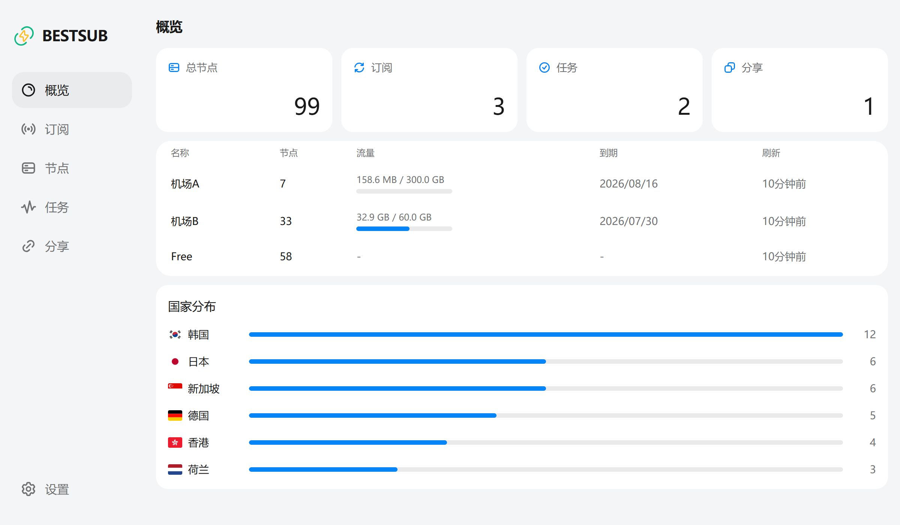
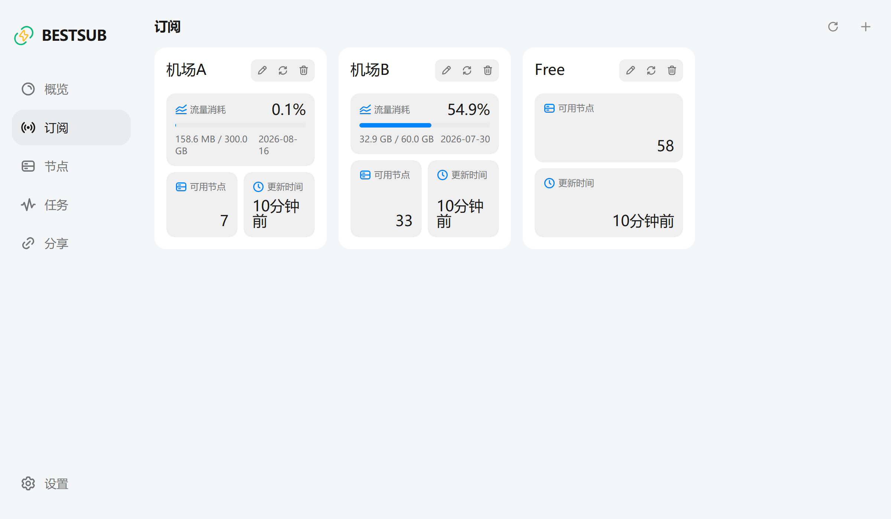
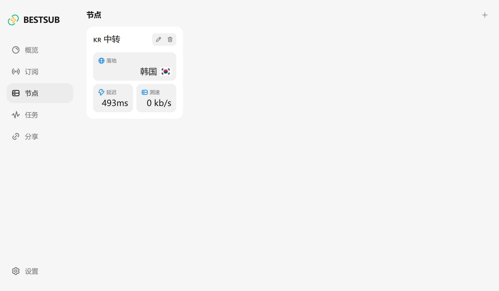
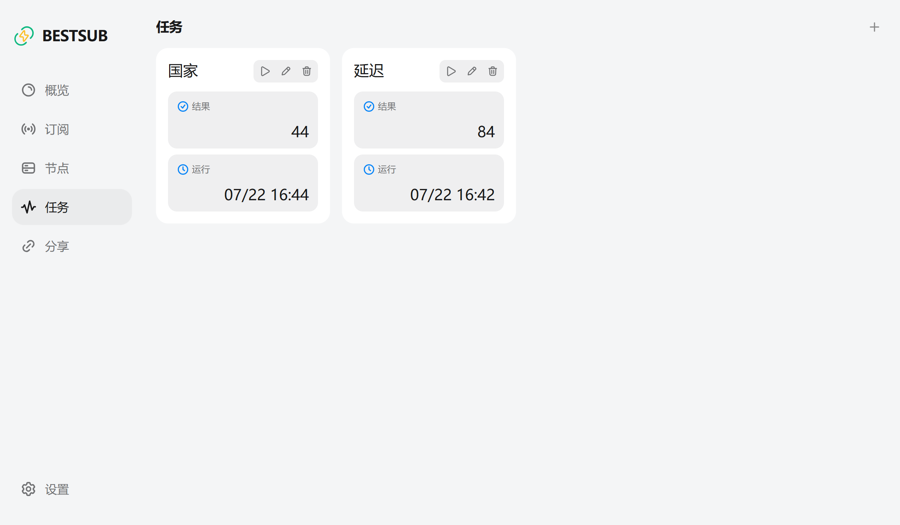
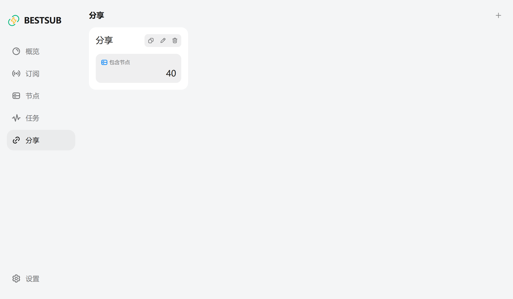
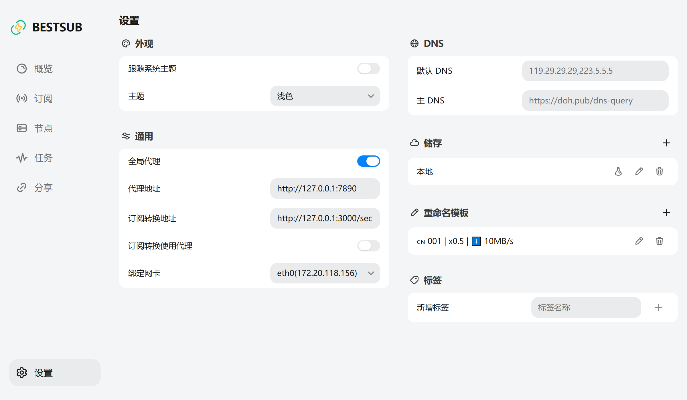

<p align="center">
  
</p>

<h1 align="center">BESTSUB</h1>

<p align="center">Best Sub, Best for Your Net</p>

## 界面截图

<p align="center">
  
  
  
  
  
  
</p>

## 快速开始（推荐）

本仓库提供一键脚本，自动启动 BestSub + MiniSubConvert，并完成基础配置。

### 前置要求

- macOS / Linux
- **Node.js 18+**（首次启动时用于构建 MiniSubConvert，可用 nvm 安装）
- 可选：Clash / Mihomo 等本地代理（仅用于 GitHub 订阅源拉取失败时的备用）

### 一键启动

```bash
bash scripts/start.sh
```

启动后访问 <http://127.0.0.1:8080>，默认账号/密码：`admin` / `admin`。

脚本会自动：

1. 启动 MiniSubConvert（默认端口 `3001`）
2. 启动 BestSub（默认端口 `8080`）
3. 写入订阅转换地址
4. 配置订阅拉取策略（见下方「网络与代理」）

### 一键全自动（订阅 + 检测 + 分享）

```bash
bash scripts/auto-setup.sh
# 或
bash scripts/start.sh --setup
```

会自动添加公开订阅源、创建检测任务、运行筛选并生成分享链接。

### 停止服务

```bash
bash scripts/stop.sh
```

### 常用命令

| 命令 | 说明 |
|------|------|
| `bash scripts/start.sh` | 启动服务 |
| `bash scripts/start.sh --setup` | 启动并完成全自动配置 |
| `bash scripts/auto-setup.sh` | 全自动配置（需服务已运行或会自动启动） |
| `bash scripts/import-subscribes.sh` | 导入 gist 订阅链接列表（约 600+ 条） |
| `bash scripts/stop.sh` | 停止服务 |
| `tail -f runtime/bestsub.log` | 查看 BestSub 日志 |
| `tail -f runtime/minisubconvert.log` | 查看转换服务日志 |

---

## 依赖说明

BESTSUB 必须依赖 [MiniSubConvert](https://github.com/bestruirui/MiniSubConvert) 或 [Sub-Store](https://github.com/sub-store-org/Sub-Store) 完成订阅转换。刷新订阅时会将原始内容 POST 到转换服务，解析为 Mihomo 格式节点。

**MiniSubConvert 转换地址格式：**

```
http://127.0.0.1:3001/minisubconvert/api/proxy/parse
```

格式为 `http://地址:端口/{SECRET}/api/proxy/parse`，其中 `SECRET` 为 MiniSubConvert 部署时设置的环境变量（Docker 默认为 `minisubconvert`）。

在 WebUI **设置 → 通用 → 订阅转换地址** 中填写上述地址。使用 `scripts/start.sh` 时会自动配置。

---

## 网络与代理

BestSub 对「拉取订阅」和「检测节点」采用不同策略：

| 场景 | 行为 |
|------|------|
| **拉取订阅链接** | 订阅代理模式为「自动」时：**先直连**，失败再**走全局代理** |
| **节点延迟 / 测速** | 通过**节点本身**探测，**不使用**全局代理，结果反映本地网络情况 |
| **订阅转换** | 默认走本地 MiniSubConvert，不经过代理 |

因此可以开启全局代理地址（如 `http://127.0.0.1:7890`），用于 GitHub 等订阅源直连失败时的备用拉取，而不会影响节点检测的真实性。

各订阅可在 WebUI 中单独设置代理模式：

- **自动**：先直连，失败后使用全局代理（推荐）
- **禁用**：始终直连
- **启用**：始终使用全局代理

---

## 获取高质量节点（工作流）

1. **启动服务**：`bash scripts/start.sh`
2. **订阅**：添加订阅链接，点击刷新（GitHub 源需本地代理可用时才能备用拉取）
3. **任务**：创建检测任务（延迟 → 测速），输入来源选「全部订阅」
4. **分享**：基于任务结果创建分享，复制链接（16 位小写 token，如 `http://127.0.0.1:8080/share/abcdefghijklmnop`）

> 分享链接中的 token 由系统自动生成，请勿使用界面占位文字作为 URL。

---

## 手动运行

### 直接运行

从 [Releases](https://github.com/bestruirui/bestsub/releases) 下载对应平台压缩包，解压后运行：

```bash
./bestsub start
```

Windows：

```powershell
.\bestsub.exe start
```

访问 <http://127.0.0.1:8080>。需自行部署 MiniSubConvert 并在设置中配置转换地址。

### Docker

推荐使用 `runtime/docker-compose.yml`，同时启动 BestSub 与 MiniSubConvert：

```bash
cd runtime
docker compose up -d
```

或在项目根目录：

```yaml
services:
  bestsub:
    image: ghcr.io/bestruirui/bestsub:latest
    container_name: bestsub
    restart: unless-stopped
    ports:
      - "8080:8080"
    volumes:
      - ./data:/app/data
    depends_on:
      - minisubconvert

  minisubconvert:
    image: ghcr.io/bestruirui/minisubconvert:latest
    container_name: minisubconvert
    restart: unless-stopped
    environment:
      - SECRET=minisubconvert
      - PORT=3000
    ports:
      - "3000:3000"
```

转换地址填写：`http://127.0.0.1:3000/minisubconvert/api/proxy/parse`

单独运行 BestSub：

```bash
docker run -d \
  --name bestsub \
  --restart unless-stopped \
  -p 8080:8080 \
  -v "$PWD/data:/app/data" \
  ghcr.io/bestruirui/bestsub:latest
```

访问 `http://服务器地址:8080`。

---

## 目录结构

```
BestSub2/
├── scripts/
│   ├── start.sh          # 一键启动
│   ├── stop.sh           # 一键停止
│   └── auto-setup.sh     # 全自动配置
├── runtime/
│   ├── bestsub           # 可执行文件（需自行下载或编译）
│   ├── data/             # 配置与数据库
│   ├── minisubconvert/   # 转换服务（首次启动自动克隆构建）
│   └── docker-compose.yml
└── web/                  # 前端源码
```

---

## 环境变量（脚本）

| 变量 | 默认值 | 说明 |
|------|--------|------|
| `BESTSUB_URL` | `http://127.0.0.1:8080` | BestSub 地址 |
| `BESTSUB_USER` | `admin` | 登录用户名 |
| `BESTSUB_PASS` | `admin` | 登录密码 |
| `MSC_PORT` | `3001` | MiniSubConvert 端口 |
| `MSC_SECRET` | `minisubconvert` | MiniSubConvert SECRET |

---

## 从源码构建

```bash
# 前端
cd web && pnpm install && pnpm run build

# 后端
go build -o runtime/bestsub .
```

需要 Go 1.26+ 与 Node.js 20+。
